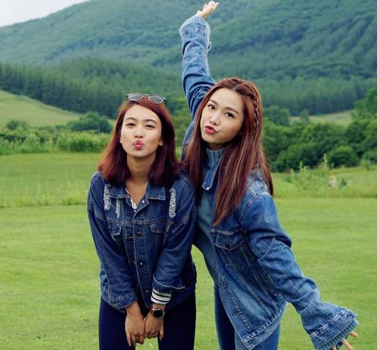

# CannyEdit: Selective Canny Control and Dual-Prompt Guidance for Training-free Image Editing

**[Project Page](https://vaynexie.github.io/CannyEdit/) | [arXiv](https://arxiv.org/pdf/2508.06937) | [Code (MindSpore)](https://github.com/mindspore-lab/mindone/tree/master/examples/canny_edit)| [Code (PyTorch) here]**

---

### Authors

Weiyan Xie*, Han Gao*, Didan Deng*, Kaican Li, April Hua Liu, Yongxiang Huang, Nevin L. Zhang

<small><i>*Indicates Equal Contribution</i></small>

<small><i>Contact: wxieai@cse.ust.hk</i></small>

### Affiliations

Huawei Hong Kong AI Framework & Data Technologies Lab, The Hong Kong University of Science and Technology, Shanghai University of Finance and Economics

---


## 🛠️ To Use CannyEdit
### Environment setup
```bash
conda create -n cannyedit python=3.10.0
conda activate cannyedit
pip install -r requirement.txt
```
### Download model weights
The FLUX.1 [Dev] and Canny ControlNet models will download automatically when running *main_cannyedit.py*. If FLUX.1 [Dev] is not cached locally, uncomment the relevant line in *main_cannyedit.py* and replace the access token with your own HuggingFace token to enable model download.
```python
# from huggingface_hub import login
# login(token="YOUR_HUGGINGFACE_ACCESS_TOKEN")
```

Additionally, CannyEdit optionally supports advanced models to enhance its editing capabilities. These include:

- Qwen2.5-VL-7B-Instruct for automatic prompt generation;

- Qwen3-4B-Instruct-2507, SAM-2, and GroundingDINO for mask extraction;

- InternVL3-14B for automatically generating point hints to indicate target edit locations.

While these models are not required for using CannyEdit, they can significantly improve the usability. You can download their weights with a single line of code:

```bash
bash ./model_checkpoints/download.sh
```


### Guideline for interactively providing edit locations with GUI
Our system supports three interactive modes for specifying edit locations via a graphical user interface (GUI). These modes are activated when mask paths are not provided:

- Oval Mask Drawing: Users can draw an oval mask to indicate where new objects should be added.
- SAM with Point Prompts: Users provide point prompts, which are used by SAM to generate segmentation masks. This mode is intended for selecting objects to be replaced or removed.
- Point Hinting: Users can click directly on the image to provide point hints that indicate where new objects should be added.

Tips: to enable GUI applications on a remote server without a display:

1. On the remote server, enable X11 forwarding:
```bash
ssh -X username@remote_server_ip  # secure forwarding
```
or
```bash
ssh -Y username@remote_server_ip  # trusted forwarding
```
2. Install and run an X11 server on your local machine, e.g.:
- MacOS: [XQuartz](xquartz.org)
- Windows: [Xming](straightrunning.com/XmingNotes)

After that, GUI applications launched on the remote server will now display on your local machine.

You may test with below to check if the X11 forwarding is working well:
```bash
xclock
```


### Examples

**Stage 1** involves running CannyEdit using user-provided masks or point hints. **Stage 2** allows for re-running CannyEdit with automatically refined masks. Stage 2 is optional, but is important for preserving the image background when using large rough binary masks or when using the point hints as indicators of editing locations.

|                 Editing                                  |                    Input_Image                                    |                     Mask(s) <br> or <br> Point Hint(s)            |                            Output(Stage 1)                       |                            Output(Stage 2)                           |                     Code               |
| :----------------------------------------------------------: | :----------------------------------------------------------: |:----------------------------------------------------------: | :----------------------------------------------------------: | :----------------------------------------------------------: | :----------------------------------------------------------: |
| Background Replacement |  |  |  | / | bash ./testcases/bg_replacement.sh |
| Subject Replacement |  |  |  | / | bash ./testcases/subject_replacement.sh |
| Object Addition |  |  |  | / | bash ./testcases/add_monkey.sh |
| Subject Replacement<br>+Object Addition |  |  <br>  |  | / | bash ./testcases/subject_replace_object_add.sh |
| Subject Removal |  |  |  | / | bash ./testcases/subject_removal.sh |
| Subject Removal |  |  |  | / | bash ./testcases/subject_removal1.sh |
| Object Addition <br> with Mask Refinement <br>(binary mask) |  |  |  |  | bash ./testcases/add_monkey_w_refine.sh |
| Object Addition  <br>with Mask Refinement <br> (binary masks) |  |  <br>  |  |  | bash ./testcases/add_manwoman_w_refine.sh |
| Object Addition  <br>with Mask Refinement <br> (point hint) |  | Point (x,y) <br> (0.12,0.35) |  |  | bash ./testcases/add_monkey_point_refine.sh |
| Object Addition  <br>with Mask Refinement <br> (point hints) |  | Point (x,y) <br> (0.4,0.6) (0.6,0.6) |  |  | bash ./testcases/add_manwoman_point_refine.sh |
| Object Addition  <br>with Mask Refinement <br> (point hint) |  | Point Inferred by InternVL3 |  |  | bash ./testcases/add_monkey_point_autoinfer.sh |
| Object Addition  <br>with Mask Refinement <br> (point hints) |  | Points Inferred by InternVL3 |  |  | bash ./testcases/add_manwoman_point_autoinfer.sh |

### Explanations to the parameters [TODO]

### More test cases [TODO]


## ✨ Highlights

### 1. High-Quality Region-Specific Image Edits
Our method enables high-quality region-specific image edits, especially useful in cases where SOTA free-form image editing methods fail to ground edits accurately.

**Prompt:** *Add a cyclist riding the bike, wearing a green and yellow jersey and sunglasses.*

|                            Input                             |                       CannyEdit (ours)                       |                     FLUX.1 Kontext [dev]                     |                            GPT-4o                            |                            Doubao                            |
| :----------------------------------------------------------: | :----------------------------------------------------------: | :----------------------------------------------------------: | :----------------------------------------------------------: | :----------------------------------------------------------: |
|  |  |  |  |  |

---

### 2. Support Multiple Edits at One Pass
Our methods can support edits on multiple user-specific regions at one generation pass when multiple masks are given.

**Prompt:** *Add a slide + Add a group of elderly men and women practicing Tai Chi.*

|                            Input                             |                       CannyEdit (ours)                       |                     FLUX.1 Kontext [dev]                     |                            GPT-4o                            |                            Doubao                            |
| :----------------------------------------------------------: | :----------------------------------------------------------: | :----------------------------------------------------------: | :----------------------------------------------------------: | :----------------------------------------------------------: |
|  |  |  |  |  |


---

### 3. Precise Local Control

#### a. Control by mask size
By specifying the mask size, our method effectively controls the size of the generated subject.

**Prompt:** *Add a sofa + Add a painting on the wall.*

|                            Input                             |                 CannyEdit <br />(small mask)                 |                CannyEdit <br />(medium mask)                 |                 CannyEdit <br />(large mask)                 |
| :----------------------------------------------------------: | :----------------------------------------------------------: | :----------------------------------------------------------: | :----------------------------------------------------------: |
|  |  |  |  |

#### b. Control by text details
By providing varying local details in the text, subjects with different visual characteristics are generated.

**Prompt:** *Add a woman customer reading a menu + Add a waiter ready to serve.*

|                            Input                             |                     CannyEdit (output 1)                     |                     CannyEdit (output 2)                     |                     CannyEdit (output 3)                     |
| :----------------------------------------------------------: | :----------------------------------------------------------: | :----------------------------------------------------------: | :----------------------------------------------------------: |
|  |  |  |  |

---

## BibTeX

If you find our work useful, please consider citing:
```bibtex
@article{xie2025canny,
  title={CannyEdit: Selective Canny Control and Dual-Prompt Guidance for Training-free Image Editing},
  author={Xie, Weiyan and Gao, Han and Deng, Didan and Li, Kaican and Liu, April Hua and Huang, Yongxiang and Zhang, Nevin L.},
  journal={arXiv preprint arXiv:2508.06937},
  year={2025}
}

```
